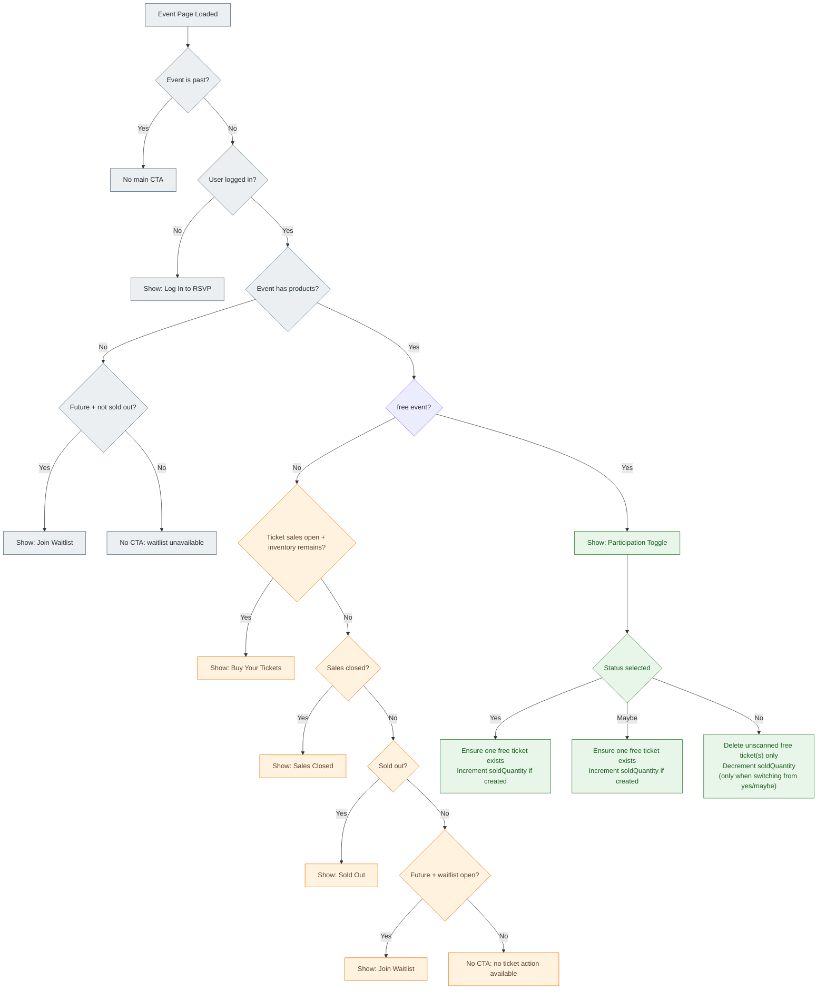
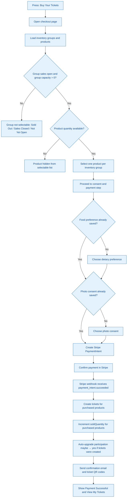

# Event CTA Flow

This document captures the CTA decision logic for the event detail page, including both free and paid ticket branches.

## Event Participation Flow

## Notes

- Paid tickets are never removed by RSVP status changes.
- Free RSVP removal path only deletes tickets tied to free transactions (`free_*`) and only if unscanned.
- Capacity is represented via `soldQuantity` and is adjusted in this free RSVP lifecycle.

## Ticket buying flow

This flow starts after pressing `Buy Your Tickets` and covers the paid checkout route end-to-end.

## Notes on Purchase Flow

- Availability is filtered twice: first by inventory group (sales window + group capacity), then by product quantity.
- Checkout currently allows one selected product per inventory group.
- Food preference and photo consent are shown only when the user has not already answered them.
- Checkout validates inventory again on submit before creating a payment intent.
- The Stripe webhook is what finalizes paid ticket creation.
- Confirmation email sending happens after ticket creation and should not fail the purchase if email delivery fails.
