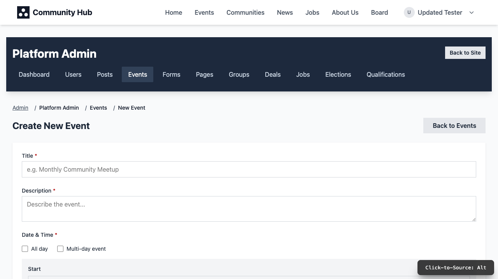
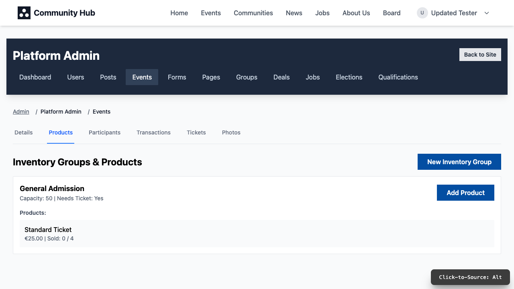
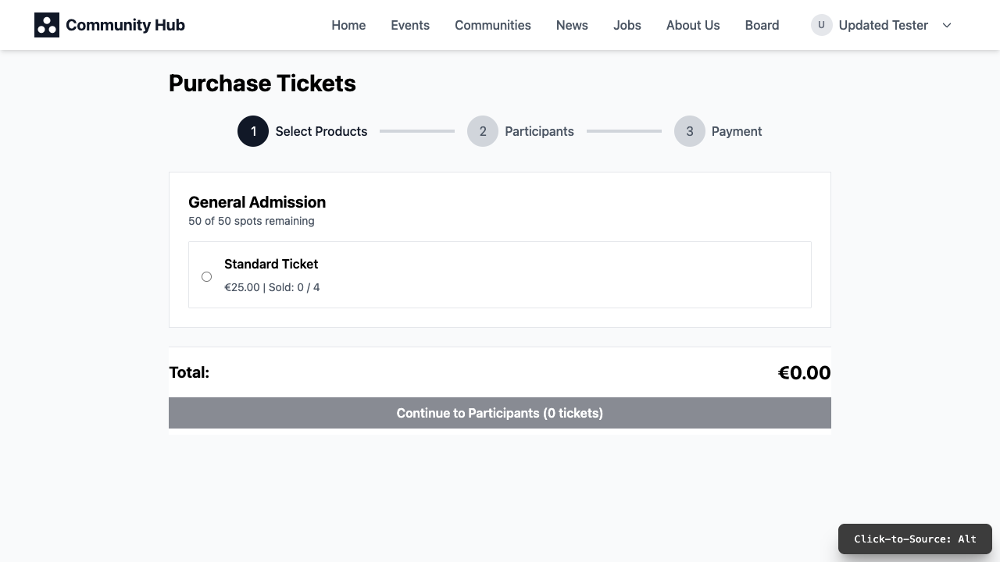
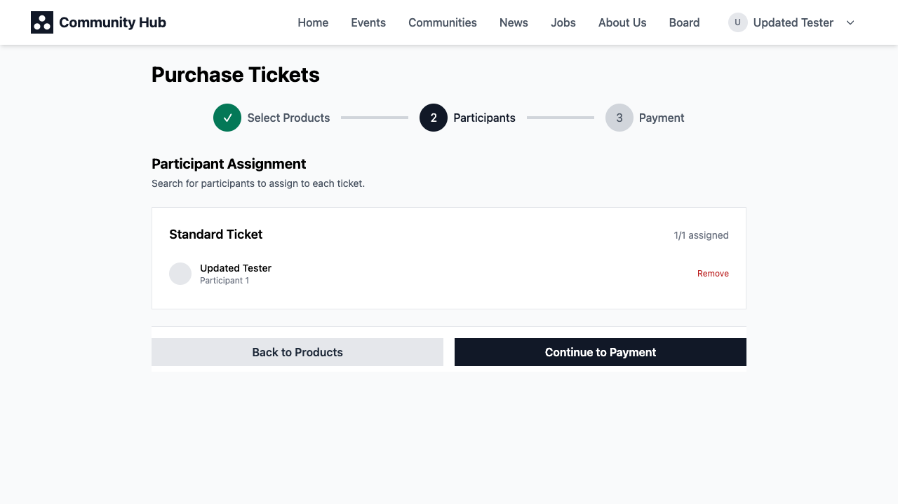
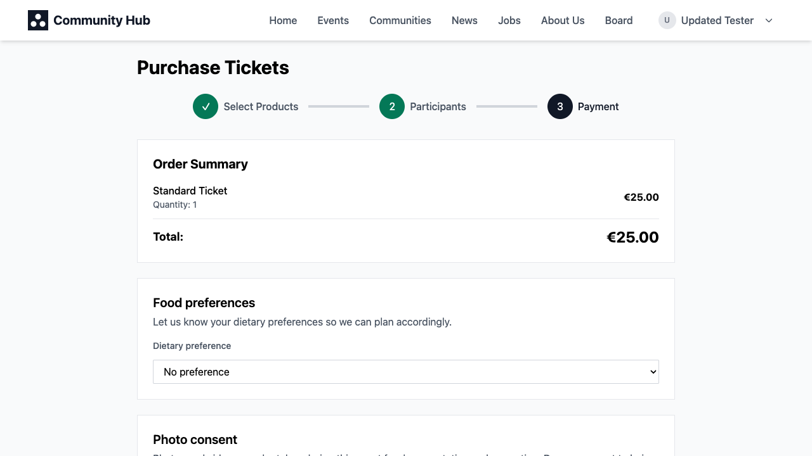

# Event & ticketing flow

An end-to-end walkthrough of how an event goes from being created to a
member scanning in at the door — written for admins and community
representatives, not developers.

(If you're a developer modifying the checkout logic or the ticketing data
model itself, see [Event CTA Flow](./event-flow.md) and [Ticket Sales
Reasoning](./event-tickets.md) instead — this doc intentionally stays at
the "how do I use this" level.)

## 1. Creating an event

An admin or community representative fills in the basics: title,
description, start and end date, whether it's in person, online, or both,
the address or a link, and whether it should be visible platform-wide or
only within one community.

## 2. Setting up tickets

Pricing and how many spots are available are configured separately, on the
event's Products tab, using two ideas:

- A **ticket group** is a pool of spots — a name, a maximum capacity, an
  optional window of dates during which it can be purchased, and a switch
  for whether it needs a scannable ticket at all (turn this off for an
  optional add-on that doesn't require checking in at the door).
- A **ticket type** lives inside a ticket group and is the actual thing a
  member buys: its name, price, how many a single member can buy, and how
  many people one purchase covers (e.g. a "Couple's Ticket" covers 2
  people).

A free (€0) ticket type works exactly the same way as a paid one — it still
goes through checkout and still produces a real, scannable ticket. This is
different from a simple RSVP (see next section).

## 3. RSVP vs. buying a ticket

These are two separate things:

- **RSVP** is a simple "going / maybe / not going" toggle, with no
  connection to payment or capacity — it's what shows on an event page when
  there's nothing to buy.
- **Buying a ticket** always goes through the checkout flow below and
  counts against the event's capacity, whether or not it's free. Buying a
  ticket automatically marks the buyer as "going," so members don't need to
  do both separately.

## 4. What a member sees at checkout — three steps

**Step 1 — choose tickets.** Remaining availability is shown live for each
ticket type.

**Step 2 — who's attending.** For each ticket, the buyer enters a name and
email per attendee it covers. The buyer is always automatically included as
the first attendee.

**Step 3 — payment.** An order summary, then (if needed) a couple of quick
questions like dietary preference and photo consent, then payment. If the
total is €0, the ticket is issued immediately with no payment step needed.

For a paid order, ticket creation is confirmed by the payment provider
after the charge goes through — so there can be a brief moment between
paying and the ticket actually appearing. If a member says they paid but
don't see a ticket after a minute or two, that's the first thing to check.

## 5. Tickets, QR codes, and checking people in

Members can see all their tickets, grouped by event, under "My Tickets" on
their own profile — each one shows as a QR code.

At the door, an admin or community representative opens the event's Scan
page and uses a phone or tablet camera to scan each attendee's QR code,
which checks them in and prevents the same ticket being used twice. The
Attendance tab shows the full check-in list.

## 6. Issuing free tickets directly

The Comp Tickets tab lets an admin issue a free ticket straight to
someone's email address without them going through checkout at all — handy
for guests, speakers, or press.
